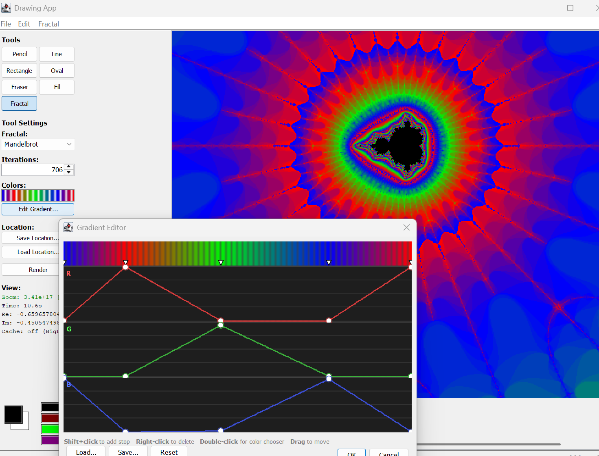

# Drawing App

A Java Swing drawing application with an integrated fractal explorer featuring arbitrary-precision deep zoom with perturbation theory optimization.



## Features

### Drawing Tools
- **Pencil, Line, Rectangle, Oval, Eraser, Flood Fill** with configurable stroke size
- **Paintbrush**: Soft radial brush with configurable opacity, hardness, shape (Round/Square/Diamond), and texture (Smooth/Speckle/Chalk/Scatter)
- **Selection tools**: Rectangle select, Magic Wand (flood-fill tolerance), Lasso (freehand) — all with marching ants, drag-to-move, and floating content
- **Eyedropper**: Left-click samples foreground color, right-click samples background — from flattened composite
- **Edit menu**: Cut (Ctrl+X), Copy (Ctrl+C), Paste (Ctrl+V), Select All (Ctrl+A), Deselect (Ctrl+D), Save Selection to Image (PNG with transparency)
- **Stroke styles**: Solid, Dashed, Dotted, Dash-Dot, Rough/Sketchy — on all shape and line tools
- **Color picker**: 20-color palette + custom color chooser, foreground/background colors
- **Pluggable fill system**: Solid, Gradient, Custom Gradient, Checkerboard, Diagonal Stripes, Crosshatch, Dot Grid, Horizontal Stripes, Noise
- **Tool-owned settings panels**: Each tool builds its own settings UI — stroke, fill, and style all sync correctly on tool switch
- **Undo/Redo**: Up to 80 levels with automatic compaction (Ctrl+Z / Ctrl+Y)
- **File I/O**: Open/Save PNG, JPG, BMP. Save (Ctrl+S) re-saves to current file; Save As (Ctrl+Shift+S) for new file. Filename shown in title bar.

### Layer System
- **Up to 20 layers** with per-layer opacity, visibility toggle, and lock
- **8 blend modes**: Normal, Multiply, Screen, Overlay, Soft Light, Hard Light, Difference, Add
- **Layer panel**: Sidebar with thumbnails, add/delete, duplicate, reorder (drag or up/down buttons), merge down, flatten
- **Layer operations**: Double-click to rename, checkbox for visibility, lock to prevent edits
- **Compositing**: Real-time layer compositing with custom blend mode implementation
- **Safety**: Drawing blocked on invisible/locked layers with user notification

### Fractal Explorer
- **5 fractal types**: Mandelbrot, Julia, Burning Ship, Tricorn, and Magnet Type I — selectable from dropdown and menu
- **Arbitrary-precision deep zoom** using BigDecimal arithmetic — no pixelation at any zoom level
- **Perturbation theory**: Computes one reference orbit at full precision, then uses fast double arithmetic for all other pixels. Automatic fallback to BigDecimal for interior pixels where perturbation is invalid.
- **Auto-switching**: Renders in double precision at shallow zoom (fast), automatically switches to perturbation + BigDecimal past ~10^13 zoom
- **Render modes**: AUTO (default), DOUBLE, BIGDECIMAL, PERTURBATION — selectable for benchmarking
- **Color modes**: Mod (cyclic) for consistent color detail at all zoom levels, or Division (linear) for smooth gradients
- **Interior pruning**: Hierarchical quadtree subdivision with 4-corner quick rejection for faster rendering of interior-heavy regions
- **Pixel guessing**: Interpolation-based rendering optimization that fills interior blocks, with toggle in the Fractal menu
- **Image zoom**: Scroll wheel zooms the rendered image (0.25x–32x) centered on cursor for pixel-level inspection without re-rendering
- **Click and drag panning**: Drag to pan the viewport — the raster image shifts with the cursor for instant visual feedback, then re-renders on release
- **Fractal zoom**: Ctrl+scroll zooms in/out of the fractal (changes complex-plane viewport and triggers re-render). Left/right click also zooms in/out centered on click position
- **Cross-render cache**: Double-precision quadtree cache for moderate zoom; BigDecimal pixel-mapping cache for deep zoom. On zoom, viewport origin snapping aligns pixel grids for 25% reuse; on pan, 75%+ reuse
- **Custom color gradients**: Full gradient editor with save/load support. Double-click a stop marker in the preview bar to open a color chooser
- **Palette-to-gradient**: Click any palette color while the fractal tool is active to auto-generate a triadic gradient
- **"I Feel Lucky"**: Button that finds a random interesting Mandelbrot location with varied boundary detail
- **Save/Load locations**: Export and import fractal coordinates as JSON for bookmarking and sharing
- **Preset locations**: Built-in menu with interesting locations from Seahorse Valley to 10^18 zoom, plus "Saved Locations" auto-populated from `data/locations/`
- **Async rendering**: Non-blocking renders with cancellation support and live progress (percentage, row count, elapsed time, ETA)
- **Extensible type system**: New fractal types auto-populate UI via registry — implement `FractalType`, register, done

### Animations
- **Zoom animation**: Keyframe-based exponential zoom with configurable frame count and interpolation, exported as numbered PNGs + AVI
- **Palette cycle**: Rotates gradient stops through a full cycle, exported as AVI
- **Iteration animation**: Animates max iteration count from low to high, exported as AVI
- **Screensaver mode**: Auto-discovers interesting Mandelbrot locations and renders them in sequence with crossfade transitions

### 3D Terrain
- **Fractal terrain renderer**: Converts fractal iteration data into a heightmap, applies colormap from the gradient, and renders a 3D perspective view with fog

### Dockable Panels
- **Dock system**: Layer panel, gradient editor, and fractal info panel are dockable — can be placed on any edge (West, East, North, South) or hidden
- **Drag reorder**: Panels within an edge can be reordered

### Project Format
- **FDP (Fractal Drawing Project)**: Custom Protobuf-based format preserving all layers (with pixel data, opacity, blend mode, visibility, lock, name), fractal state, and gradient. Standard image formats (PNG/JPG/BMP) flatten all layers on export.

## Build & Run

Requires Java 17+. No Maven or Gradle needed — just `javac` and the bundled JARs in `lib/`.

```bash
git clone https://github.com/seanick80/fractaldrawing.git
cd fractaldrawing

# Build and run
./build.sh run

# Or build separately
./build.sh
```

The app auto-discovers the `data/` directory relative to its classpath, providing default gradients and saved locations. CLI overrides are available:

```bash
java -cp "out;lib/protobuf-java-4.29.3.jar" com.seanick80.drawingapp.DrawingApp \
    --gradient-dir path/to/gradients \
    --location-dir path/to/locations
```

## Testing

223 tests across 33 JUnit 5 test classes, organized by size with tag-based filtering.

```bash
# Run all JUnit tests
./test.sh

# Run by size
./test.sh small     # unit tests (< 50ms each)
./test.sh medium    # integration tests (< 500ms each)
./test.sh large     # render tests (< 5s each)
./test.sh parser    # file format tests
```

Test annotations: `@SmallTest`, `@MediumTest`, `@LargeTest` (composed annotations wrapping JUnit `@Tag`). Tests are colocated with source files.

Tests cover:
- Golden-value pixel checksums for Mandelbrot, Julia (double, perturbation, BigDecimal)
- Perturbation vs BigDecimal correctness (structural match, interior pixel accuracy)
- Deep zoom overflow handling (zoom > 10^17)
- All 5 fractal types: iteration properties, BigDecimal/double agreement, rendering validity
- Cross-mode rendering (all types × DOUBLE + BIGDECIMAL)
- Interior pruning correctness: pixel-identical output with pruning on/off
- Pixel guessing accuracy vs exact rendering
- Layer system: creation, opacity, visibility, blend modes, compositing, reorder, merge, flatten
- Fill providers: solid, gradient, custom gradient, checkerboard, stripes, crosshatch, dot grid, noise
- Stroke styles: all 5 styles create valid strokes
- FDP project format: round-trip serialization for layers, fractal state, gradients, BigDecimal precision
- Gradient files: save/load, interpolation, copy semantics
- JSON location parsing: round-trip, edge cases
- Zoom animation: keyframe interpolation, frame rendering
- Palette cycle and iteration animation
- AVI writer: RIFF header, frame count
- Undo manager: basic ops, compaction, multi-layer support
- Dock system: docking, undocking, edge placement, hide/show
- Drawing tools: pencil, line, rectangle (outline + filled), oval, eraser, flood fill, paintbrush, eyedropper
- Selection tools: rectangle select, magic wand, lasso — selection creation, copy, cut, move, commit
- Tool capabilities: hasStrokeSize, hasFill, default sizes, names

## Benchmarking

```bash
# Performance benchmark
java -cp "out;lib/protobuf-java-4.29.3.jar" com.seanick80.drawingapp.fractal.FractalBenchmark data/benchmarks/

# Perturbation correctness evaluation
java -cp "out;lib/protobuf-java-4.29.3.jar" com.seanick80.drawingapp.fractal.PerturbationEval data/benchmarks/

# Single location with custom size
java -cp "out;lib/protobuf-java-4.29.3.jar" com.seanick80.drawingapp.fractal.FractalBenchmark data/benchmarks/bigdecimal_location.json 800 600
```

## Architecture

```
data/
├── benchmarks/              # Benchmark location files and baseline results
├── gradients/               # Default .grd color gradient files
└── locations/               # Saved fractal locations (.json), auto-populates menu

docs/
├── test-framework-guide.md  # JUnit 5 test framework reference
├── future_work.md           # Planned features
├── layers_and_objects.md    # Layer system design (historical)
└── refactoring_options.md   # Refactoring decisions (historical)

lib/
├── protobuf-java-4.29.3.jar                    # Protobuf runtime for FDP format
└── junit-platform-console-standalone-1.11.4.jar # JUnit 5 test runner

src/com/seanick80/drawingapp/
├── DrawingApp.java          # Main frame, menus (File, Edit, Fractal)
├── DrawingCanvas.java       # Canvas with layer compositing and event routing
├── ToolBar.java             # Tool selection and settings panel host
├── UndoManager.java         # Layer-aware undo/redo with compaction
├── SmallTest.java           # @SmallTest composed annotation (@Tag("small"))
├── MediumTest.java          # @MediumTest composed annotation (@Tag("medium"))
├── LargeTest.java           # @LargeTest composed annotation (@Tag("large"))
├── TestHelpers.java         # Shared test utilities
├── layers/
│   ├── Layer.java               # Single layer: image + opacity + blend + visibility
│   ├── LayerManager.java        # Ordered layer list, compositing, max 20 layers
│   ├── LayerPanel.java          # Sidebar UI with drag-to-reorder
│   ├── BlendMode.java           # Enum: Normal, Multiply, Screen, Overlay, etc.
│   └── BlendComposite.java      # Custom AWT Composite for blend mode pixel math
├── fills/                   # Pluggable fill providers (9 types)
├── gradient/                # Color gradient editor and interpolation
├── dock/                    # Dockable panel system
├── project/                 # FDP serialization (Protobuf)
├── fractal/
│   ├── FractalType.java         # Interface for fractal iteration
│   ├── FractalTypeRegistry.java # Dynamic type registry (auto-populates UI)
│   ├── MandelbrotType.java      # z²+c
│   ├── JuliaType.java           # z²+c (fixed c)
│   ├── BurningShipType.java     # (|Re(z)|+i|Im(z)|)²+c
│   ├── TricornType.java         # conj(z)²+c
│   ├── MagnetTypeIType.java     # ((z²+c-1)/(2z+c-2))²
│   ├── PerturbationStrategy.java    # Perturbation theory interface
│   ├── MandelbrotPerturbation.java  # Mandelbrot perturbation impl
│   ├── JuliaPerturbation.java       # Julia perturbation impl
│   ├── FractalRenderer.java     # Rendering orchestrator: mode selection, async
│   ├── ViewportCalculator.java  # Aspect-ratio-corrected viewport math
│   ├── FractalColorMapper.java  # Color LUT construction + mapping
│   ├── IterationQuadTree.java   # Spatial cache for iteration counts
│   ├── ZoomAnimator.java        # Zoom movie generator
│   ├── PaletteCycleAnimator.java # Gradient rotation animation
│   ├── IterationAnimator.java   # Iteration count animation
│   ├── ScreensaverController.java # Auto-explore screensaver mode
│   ├── TerrainRenderer.java     # 3D fractal terrain
│   ├── AviWriter.java           # Uncompressed RGB AVI writer
│   ├── FractalBenchmark.java    # CLI performance benchmark
│   ├── PerturbationEval.java    # CLI perturbation correctness evaluation
│   └── FractalRenderJUnit5Test.java # Render determinism, golden checksums (large)
└── tools/
    ├── Tool.java                # Tool interface with capability methods
    ├── ToolSettingsBuilder.java # Shared UI builders for stroke/fill panels
    ├── ToolSettingsContext.java # Context for tool settings (fill registry, etc.)
    ├── StrokeStyle.java         # Enum: Solid, Dashed, Dotted, Dash-Dot, Rough
    ├── FractalTool.java         # Fractal UI: zoom, pan, save/load, async render
    ├── FractalRenderController.java  # Async render orchestration
    ├── FractalSettingsPanel.java     # Fractal tool settings UI
    ├── FractalMenuBuilder.java       # Fractal menu construction
    ├── FractalAnimationController.java # Animation orchestration
    ├── SelectionTool.java           # Rectangle select with move, marching ants
    ├── MagicWandTool.java           # Flood-fill tolerance selection with bitmap mask
    ├── LassoTool.java               # Freehand lasso selection
    ├── PaintbrushTool.java          # Soft radial brush with shape/texture options
    ├── EyedropperTool.java          # Color sampler from composite image
    └── ...                      # Pencil, Line, Rectangle, Oval, Eraser, Fill
```

## Adding Custom Fills

1. Create a class implementing `FillProvider` in `src/com/seanick80/drawingapp/fills/`
2. Register it in `DrawingApp.registerDefaultFills()`

```java
public class MyCustomFill implements FillProvider {
    @Override public String getName() { return "My Fill"; }

    @Override
    public Paint createPaint(Color baseColor, int x, int y, int w, int h) {
        return new GradientPaint(x, y, baseColor, x + w, y, Color.WHITE);
    }
}
```

## Adding New Fractal Types

1. Create a class implementing `FractalType` with `iterate()` and `iterateBig()` methods
2. Register it in `FractalTypeRegistry` static initializer — it auto-appears in the UI

```java
public final class MyFractalType implements FractalType {
    @Override public String name() { return "MY_FRACTAL"; }

    @Override
    public int iterate(double cx, double cy, int maxIter) {
        // Your escape-time iteration formula here
    }

    @Override
    public int iterateBig(BigDecimal cx, BigDecimal cy, int maxIter, MathContext mc) {
        // Same formula in arbitrary precision
    }
}
```
